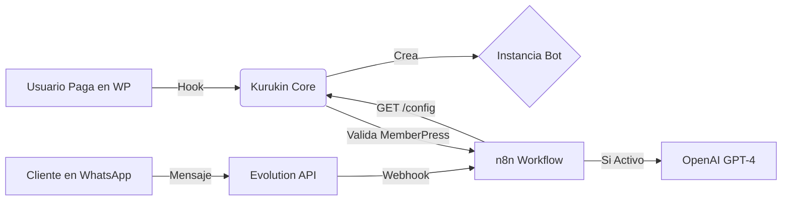

# 🧠 Kurukin Core (SaaS Engine)

> **Versión:** 1.3.0  
> **Estado:** 🟢 Producción / Estable  
> **Arquitectura:** User-Centric Multi-Tenancy

## 📖 Descripción del Proyecto

**Kurukin Core** es el motor central del SaaS **Kurukin IA**. Este plugin de WordPress actúa como el "cerebro orquestador" que vincula la gestión de usuarios y pagos (WordPress + MemberPress) con la infraestructura de IA y mensajería (n8n + Evolution API + OpenAI).

Su función principal es transformar una instalación de WordPress en una plataforma SaaS automatizada, donde cada usuario registrado obtiene automáticamente una "Instancia de Bot" personalizada, protegida por su estado de suscripción.

---

## 🏗️ Arquitectura del Sistema

El sistema opera bajo un modelo de **Multi-tenencia centrada en el usuario**:

1.  **Identity Provider:** WordPress maneja la identidad (`user_login`) y autenticación.
2.  **Payment Gatekeeper:** MemberPress controla el acceso. Si no hay pago, la API devuelve `402 Payment Required`.
3.  **Bot Provisioning:** Al registrarse un usuario, este plugin crea automáticamente un Custom Post Type (`saas_instance`) vinculado a su cuenta.
4.  **Configuration Hub:** n8n consulta este plugin para saber cómo debe comportarse el bot de cada cliente (Prompt, Modelo, Vertical de Negocio).



---

## 🚀 Características Principales

* **Auto-Provisioning:** Creación automática de instancias de bot basadas en el `user_login` del usuario al registrarse.
* **MemberPress Integration:** Bloqueo nativo de la API. Si la membresía caduca, el bot deja de responder automáticamente.
* **Seguridad de Grado Militar:**
* Las API Keys de OpenAI se almacenan encriptadas (AES-256-CBC) en la base de datos.
* Comunicación API protegida por Headers personalizados y validación de Hash.


* **API REST Personalizada:** Endpoint ligero y optimizado para consultas de alta velocidad desde n8n.
* **Carga Diferida:** Arquitectura optimizada para evitar condiciones de carrera (Race Conditions) en el arranque de WordPress.

---

## ⚙️ Instalación y Configuración

### 1. Requisitos del Servidor

* PHP 8.0 o superior.
* WordPress 6.0+.
* Extensiones PHP: `openssl`.
* (Opcional pero recomendado) MemberPress instalado y activo.

### 2. Constantes en `wp-config.php`

Para que el plugin funcione, debes definir las siguientes constantes en tu archivo de configuración o en tu entorno Docker:

```php
// Llave maestra para encriptar datos en la DB
define('KURUKIN_ENCRYPTION_KEY', 'tu_clave_super_secreta_32_caracteres');

// Token compartido para validar peticiones desde n8n
define('KURUKIN_API_SECRET', 'token_compartido_seguro_n8n_wp_2026');

```

---

## 🔌 Documentación de API (Para n8n)

El plugin expone un endpoint REST para obtener la configuración del bot en tiempo real.

### Obtener Configuración de Instancia

**Endpoint:**
`GET /wp-json/kurukin/v1/config`

**Headers Requeridos:**
| Header | Valor | Descripción |
| :--- | :--- | :--- |
| `x-kurukin-secret` | `{{KURUKIN_API_SECRET}}` | Token definido en wp-config |

**Parámetros (Query Param):**
| Parámetro | Tipo | Descripción |
| :--- | :--- | :--- |
| `instance_id` | `string` | El **username** del usuario en WordPress (ej: `cliente_pyme_01`) |

### Respuestas

#### ✅ 200 OK (Activo y Pagado)

```json
{
  "status": "success",
  "router_logic": {
    "workflow_mode": "catalog",
    "version": "1.0",
    "plan_status": "active"
  },
  "ai_brain": {
    "provider": "openai",
    "api_key": "sk-proj-....",
    "model": "gpt-4o",
    "system_prompt": "Eres un asistente experto en ventas..."
  },
  "business_data": []
}

```

#### ⛔ 402 Payment Required

El usuario existe pero su suscripción en MemberPress ha caducado o no existe.

```json
{
  "code": "402",
  "message": "Payment Required: Subscription Inactive",
  "data": { "status": 402 }
}

```

#### ⛔ 403 Forbidden

El `x-kurukin-secret` es incorrecto.

#### ⛔ 404 Not Found

El usuario no existe en la base de datos.

---

## 🛠️ Desarrollo

### Estructura de Archivos

```text
kurukin-core/
├── kurukin-core.php           # Entry Point & Loader
├── includes/
│   ├── class-kurukin-fields.php       # Metaboxes & Admin UI
│   ├── api/
│   │   └── class-kurukin-api-controller.php  # REST API Logic
│   ├── integrations/
│   │   └── class-kurukin-memberpress.php     # User Auto-creation Logic
│   └── services/
│       └── class-kurukin-bridge.php          # Outbound Webhooks (Future Use)

```

---

## 📜 Historial de Versiones (Changelog)

### [1.3.0] - 2026-01-28

* **Feat:** Integración completa con MemberPress.
* **Feat:** Lógica de "Auto-create" al registrar usuarios.
* **Feat:** El `instance_id` ahora se mapea directamente al `user_login`.

### [1.2.1] - 2026-01-28

* **Fix:** Solucionado error fatal por condición de carrera usando hook `rest_api_init`.
* **Refactor:** Limpieza de código en el controlador API.

### [1.0.0] - 2026-01-27

* Versión inicial. CPT `saas_instance` y campos encriptados.

---

## 👨‍💻 Autor

**Javier Quiroz** Lead Architect @ Kurukin IA

GitHub: [@soyjavierquiroz](https://www.google.com/search?q=https://github.com/soyjavierquiroz)

---

*Este software es propiedad privada y confidencial de Kurukin IA.*
